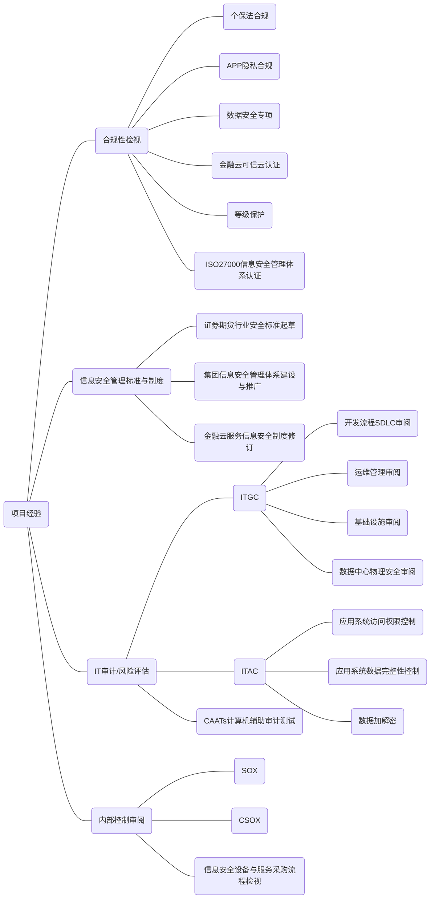
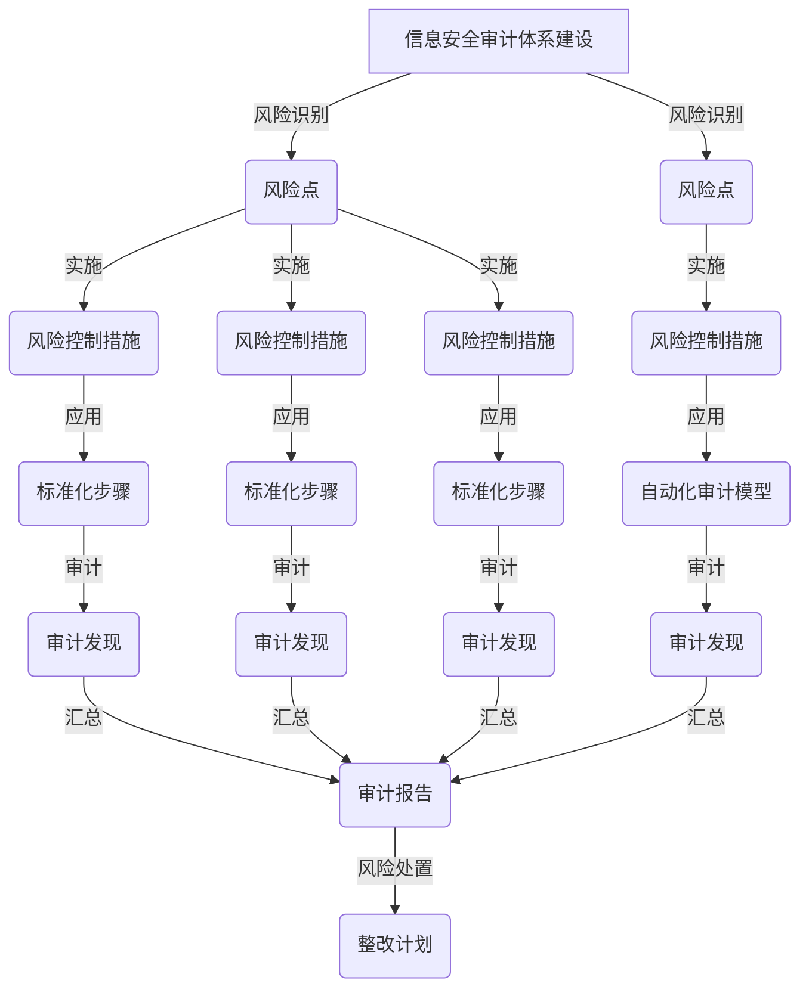

# liuyi
contact leonard.liu#QQ`com
#### 工作经验
安全管理体系建设与推广，系统安全评审与合规，信息安全风险评估与审计

#### 工作经历
|时间|公司|职位|项目|
|--|--|--|--|
|2022.09-|深圳希音信息技术有限公司|资深信息安全审计师|● 承担信息安全审计体系建设 ●  承担敏感数据流转审计与治理专项 |
|2018.02-2022.09|平安科技（深圳）有限公司|资深信息安全审计师|● 承担《个人信息保护法》合规自查专项 ● 承担集团APP隐私合规自查专项  ●  承担公司信息安全管理体系制度修订及推广实施  ● 承担等级保护测评实施  ● 信息安全审计：  1. 信息安全管理体系运行审计  2. 安全开发流程 SDLC 管理审计  3. 运维安全审计，包括变更管理、应用系统部署、监控、事件响应、用户及权限管理；  4. 应用系统安全控制审计，包括数据处理保密性、完整性，用户认证及访问权限、Web 安全漏洞检测等；  5. 基础设施安全，包括主机操作系统、数据库系统、网络防火墙等安全配置/漏洞检测，数据中心物理安全审计；  ● 数据安全专项审计：集团大数据系统数据防泄漏审计、数据库访问与操作审计、数据库操作审计自动化  ● 资金安全专项审计，包括 CSOX 内部控制审计、合同采购流程审计  ● 供应商安全审计，包括客户个人数据防泄漏、银行卡制卡、电话呼叫中心系统开发等|
|2015.10-2018.02|深圳证券通信有限公司|资深信息安全工程师|● 承担证监会《证券期货行业云计算安全规范》起草  ● 担任公司金融云服务信息安全认证PMO  ● 承担公司金融云服务信息安全制度修订  ● 承担公司信息安全管理体系ISO27001审核  ● 承担公司自研证券通信及交易系统平台架构与功能安全评审|
|2014.02-2015.04|普华永道商务咨询（上海）有限公司|资深咨询顾问|● 财务报告及CSOX审计  1. ITGC/ITAC审阅  2. 会计凭证控制审阅  ● 风险管理及内部控制咨询  服务客户：腾讯，华南快速，广深铁路，深圳燃气等|
|2012.04-2013.11|平安科技（深圳）有限公司|资深信息安全审计师|● 信息安全常规审查：  1. 安全开发流程SDLC管理审计  2. 运维安全审计，包括变更管理、应用系统部署、监控、事件响应、用户及权限管理；  3. 应用系统安全控制审计，包括数据处理保密性、完整性，用户认证及访问权限、Web安全漏洞检测等；  4. 基础设施安全，包括主机操作系统、数据库系统、网络防火墙等安全配置审计/漏洞检测，数据中心物理安全审计；  ● CSOX内部控制审计  ● 供应商信息安全审计，包括银行卡制卡等|
|2007.08-2011.11|安永（中国）企业咨询有限公司|资深咨询顾问|● 财务报告及CSOX审计  1. ITGC/ITAC审阅  2. 会计凭证控制审阅  ● 风险管理及内部控制咨询  服务客户：TCL移动、TCL电子、三一重工、平安银行、工商银行、安信证券、沃尔玛、500彩 票网等|
|2006.06-2007.07|华为技术有限公司|性能测试工程师|遵循华为软件开发流程，分析通信设备及软件潜在缺陷、性能瓶颈，并反馈分析报告。|
#### 教育经历
|院校|专业|学历|时间|
|--|--|--|--|
|华中科技大学|计算机软件与理论|硕士|2003-2006|
|武汉大学|通信工程|学士|1998-2002|

#### 资格证书

1.  CISA注册信息系统审计师
2.  CIA注册内部审计师
